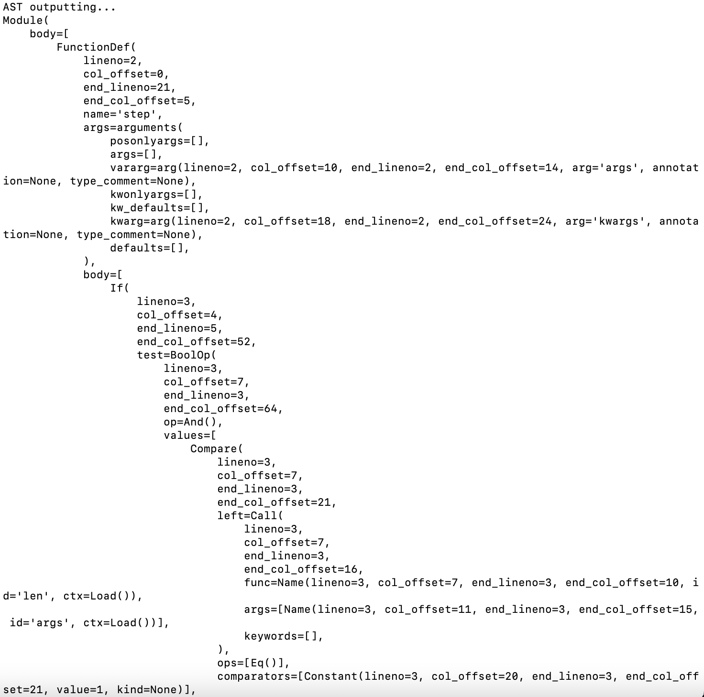
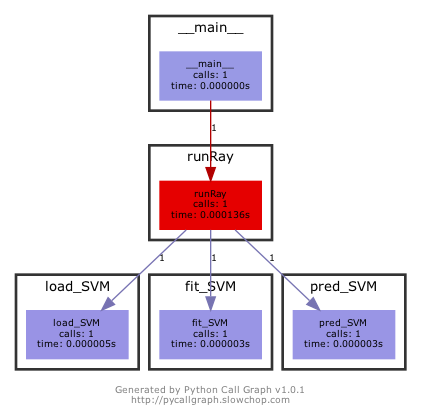

# ML4SE_Milestone1

## USAGE:

The script milestone1.py prints out representations for the Ray package. The flags are --representation for the type of representation desired and --help to see list of flags. Valid arguments for --representation are CG, AST, and CFG. Example: python3 milestone1.py --representation AST

CG will output a file with the relevant CG

CFG will output a file with the relevant CFG (api.py file is used as input)


## REQUIREMENTS:

Environments:
python3, at least version 3.6

Packages:
sklearn,
astpretty,
pycallgraph,
staticfg,
Graphviz


## EXAMPLE:

Run ```python3 milestone1.py --representation AST``` and the output should begin with 


Run ```python3 milestone1.py --representation CG``` and the output should be 

.


Run ```python3 milestone1.py --representation CFG``` and the output should be .

